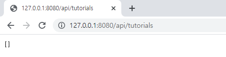
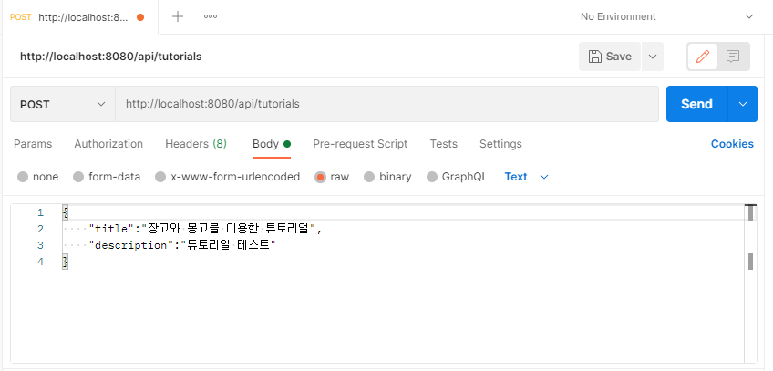
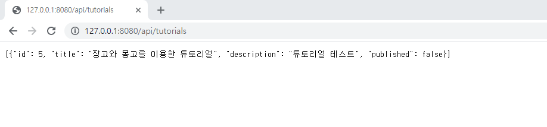
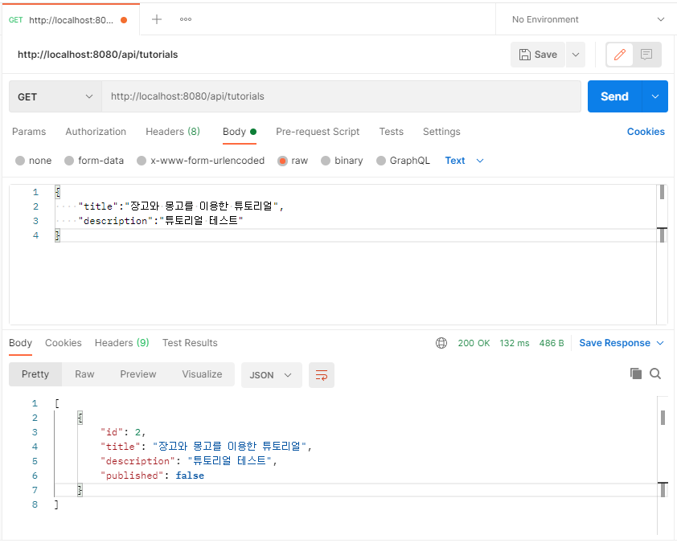
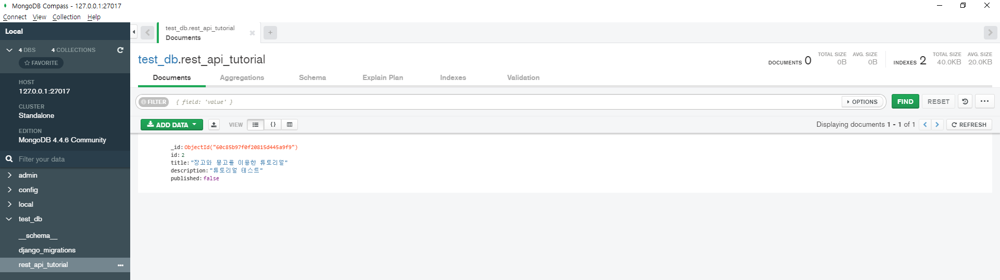

# Django와 MongoDB를 이용한 REST_API 만들기
### 가상환경에서 사용된 Package
#### requirement.txt
    asgiref==3.3.4
    Django==3.2.4
    django-cors-headers==3.7.0
    djangorestframework==3.12.4
    djongo==1.3.6
    pymongo==3.11.4
    pytz==2021.1
    sqlparse==0.2.4
#### `Django` 설치 및 Django용 RestFramework인 `djangorestframework` Package 설치
    pip install django
    pip install djangorestframework
#### /DjangoRestApiMongoDB/setting.py
    INSTALLED_APPS에 'rest_framework' 추가
    TIME_ZONE = 'Asia/Seoul'로 변경 
#### Django용 mongoDB인 `djongo`  설치
    pip install djongo
#### /DjangoRestApiMongoDB/setting.py 에서 DATABASES를 수정 
    DATABASES = {
        'default': {
            'ENGINE': 'djongo',
            'NAME': 'test_db',
            'HOST':'127.0.0.1',
            'PORT':27017,
        }
    }
#### RESTAPI를 만들 App을 생성
    python manage.py startapp rest_api
#### rest_api/apps.py 에서 class 확인
    from django.apps import AppConfig

    class RestApiConfig(AppConfig):
        default_auto_field = 'django.db.models.BigAutoField'
        name = 'rest_api'
##### /DjangoRestApiMongoDB/setting.py
    INSTALLED_APP에 'rest_api.apps.RestApiConfig' 추가
#### API 통신을 위해선 CORS가 있어야 하므로 `django-cors-headers` 설치
    pip install django-cors-headers
##### /DjangoRestApiMongoDB/setting.py
    MIDDLEWARE에 
    'corsheaders.middleware.CorsMiddleware' 및
    'django.middleware.common.CommonMiddleware'를 추가
    끝부분에
    CORS_ORIGIN_ALLOW_ALL = False   #모든 포트 허용 X
    CORS_ORIGIN_WHITELIST = ( 
    'http://localhost:8081',
    )  # http://localhost:8081 에서 오는 request만 허용
    추가
##### rest_api/models.py
    from django.db import models
    
    class Tutorial(models.Model):
        title = models.CharField(max_length=70, blank=False, default='')
        description = models.CharField(max_length=200,blank=False, default='')
        published = models.BooleanField(default=False)
    # Tutorial이라는 클래스를 생성하고 title,description,published 필드 생성

##### db migration
    python manage.py makemigrations rest_api   (MongoDB가 설치되어 있어야 함)
    
#### migration 성공 후 rest_api/migrations/0001_initial.py 확인
    # Generated by Django 3.2.4 on 2021-06-15 05:03
    
    from django.db import migrations, models
    
    
    class Migration(migrations.Migration):
    
        initial = True
    
        dependencies = [
        ]
    
        operations = [
            migrations.CreateModel(
                name='Tutorial',
                fields=[
                    ('id', models.BigAutoField(auto_created=True, primary_key=True, serialize=False, verbose_name='ID')),
                    ('title', models.CharField(default='', max_length=70)),
                    ('description', models.CharField(default='', max_length=200)),
                    ('published', models.BooleanField(default=False)),
                ],
            ),
        ]
#### migrate
    python manage.py migrate rest_api
#### tutorial instance를 json과 같은 포맷으로 만들기위해 rest_api/serializers.py 생성
    class TutorialSerializer(serializers.ModelSerializer):

        class Meta:
            model = Tutorial
            fields = ('id',
                      'title',
                      'description',
                      'published')
#### rest_api/urls.py 생성
* /api/tutorials: GET, POST, DELETE
* /api/tutorials/:id: GET, PUT, DELETE
* /api/tutorials/published: GET 의 형태로 url을 정의

    from django.conf.urls import url 
    from rest_api import views 
     
    urlpatterns = [ 
        url(r'^api/tutorials$', views.tutorial_list),
        url(r'^api/tutorials/(?P<pk>[0-9]+)$', views.tutorial_detail),
        #api/tutorials (?p):이 영역의 문자열에 정규표현식을 적용해서 pk가 [0-9]+ 패턴에 부합되는 것들만 views.tutorial_detail로 넘기겠다.
        url(r'^api/tutorials/published$', views.tutorial_list_published)
    ]
##### /DjangoRestApiMongoDB/urls.py
    from django.conf.urls import url, include
    from django.contrib import admin
    
    urlpatterns = [
        url(r'^admin/', admin.site.urls),
        url(r'^', include('rest_api.urls')),
    ]
##### /rest_api/views.py
    from django.http import JsonResponse
    from django.shortcuts import render

    from rest_framework import status
    from rest_framework.decorators import api_view
    from rest_framework.parsers import JSONParser
    
    from rest_api.models import Tutorial
    from rest_api.serializers import TutorialSerializer
    
    @api_view(['GET','POST','DELETE'])
    def tutorial_list(request):
        if request.method == 'GET':   #request가 GET일시
            tutorials = Tutorial.objects.all()  # Tutorial을 기준으로 읽어올 값을 뽑아옴 
    
            title = request.GET.get('title',None) # Tutorial의 title이 get의 title가 일치하는 것을 가져온다. 

            if title is not None: # 일치하는 것이 없을 시
                tutorials = tutorials.filter(title_icontains=title) # 대소문자 구분하지 않고 tutorial의 title를 검색   
    
            tutorials_serializer = TutorialSerializer(tutorials,many=True) # tutorials의 data를 dictionary를 가지는 리스트로 반환
            return JsonResponse(tutorials_serializer.data,safe=False,json_dumps_params={'ensure_ascii': False}) # tutorials_serializer.data 의 데이터를 Json형태로 response
    
        elif request.method == 'POST': #request가 post일시
            tutorial_data=JSONParser().parse(request) # request의 instance가 dictionary형으로 변경
            tutorial_serializer = TutorialSerializer(data=tutorial_data) 
            if tutorial_serializer.is_valid(): # tutorial_serializer가 유효할 시 
                tutorial_serializer.save() # tutorial_serializer 저장
                return JsonResponse(tutorial_serializer.data,status=status.HTTP_201_CREATED,json_dumps_params={'ensure_ascii': False}) # # tutorials_serializer.data 의 데이터를 Json형태로 response 후 HTTP_201_CREATED를 보여준다.
            return JsonResponse(tutorial_serializer.errors,status=status.HTTP_400_BAD_REQUEST,json_dumps_params={'ensure_ascii': False})
        elif request.method == 'DELETE':
            count = Tutorial.objects.all().delete() # Tutorial의 데이터 모델 삭제
            return JsonResponse({'message':'{} Tutorials were deleted successfully!'.format(count[0])}, status=status.HTTP_204_NO_CONTENT,json_dumps_params={'ensure_ascii': False})
    
    @api_view(['GET','PUT','DELETE'])
    def tutorial_detail(request,pk):
        try:
            tutorial = Tutorial.objects.get(pk=pk)
        except Tutorial.DoesNotExist:
            return JsonResponse({'message': 'The tutorial does not exist'}, status=status.HTTP_404_NOT_FOUND,json_dumps_params={'ensure_ascii': False})
    
        if request.method == 'GET':
            tutorial_serializer = TutorialSerializer(tutorial)
            return JsonResponse(tutorial_serializer.data,json_dumps_params={'ensure_ascii': False})
        elif request.method == 'PUT':
            tutorial_data = JSONParser().parse(request)
            tutorial_serializer = TutorialSerializer(tutorial,data=tutorial_data)
            if tutorial_serializer.is_valid():
                tutorial_serializer.save()
                return JsonResponse(tutorial_serializer.data)
            return JsonResponse(tutorial_serializer.errors,status=status.HTTP_400_BAD_REQUEST,json_dumps_params={'ensure_ascii': False})
    
        elif request.method == 'DELETE':
            tutorial.delete()
            return JsonResponse({'message': 'Tutorial was deleted successfully!'}, status=status.HTTP_204_NO_CONTENT,json_dumps_params={'ensure_ascii': False})
    
    @api_view(['GET'])
    def tutorial_list_published(request):
        tutorials = Tutorial.objects.filter(published=True)
    
        if request.method == 'GET':
            tutorials_serializer = TutorialSerializer(tutorials,many=True)
            return JsonResponse(tutorials_serializer.data,safe=False,json_dumps_params={'ensure_ascii': False})

#####
    python manage.py runserver 8080 실행
http://127.0.0.1:8080/api/tutorials 접속

##### 아직 데이터를 넣지 않아 빈 배열이 뜬다.
##### Postman에서 Data Input

    Post 요청으로 데이터 넣기
    {
        "title":"장고와 몽고를 이용한 튜토리얼",
        "description":"튜토리얼 테스트"
    }
##### http://127.0.0.1:8080/api/tutorials 재접속 시 밑의 그림과 같이 확인할 수 있다.

 
 
##### Postman에서 get요청으로 데이터 확인하기

    
    get 요청으로 데이터 확인하기
    {
        "title":"장고와 몽고를 이용한 튜토리얼",
        "description":"튜토리얼 테스트"
    }
##### MongoDB Compass에서 확인하기
